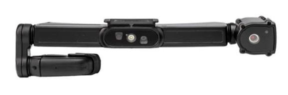
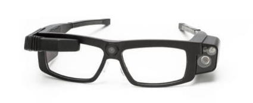
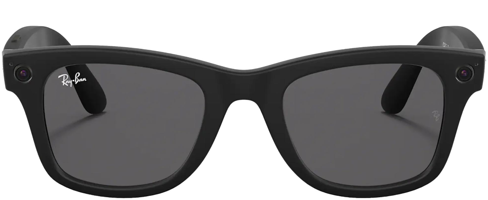
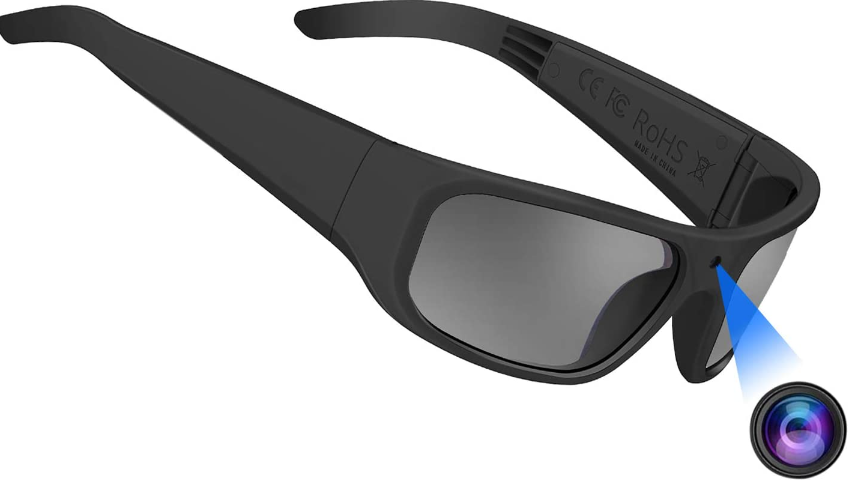
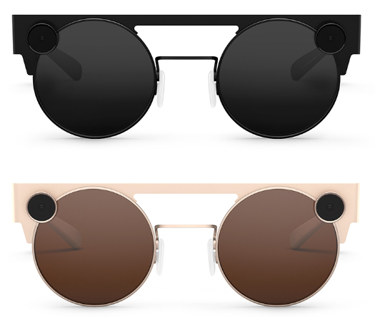

# Market Analysis

The Digihub project for Sensotec and Licht&Liefde focuses on the support and care for (near-)blind people. We are tasked to create a low-budget solution for the visually impaired. The main focus of the initial project is to present a proof of work, meaning we need a working prototype. To accomplish this, we first need a market research of existing products and software. By doing this we make sure that we are not reinventing unnecessary things, and can already make use of existing/proven concepts.

## Hardware

When looking at the hardware aspect of the project, preferably we want the following features to be present:

### Camera

A good quality camera is necessary to provide the employees a clear vision of what the client sees. There are a lot of different camera's in the market, ranging from more expensive to less expensive. Minimum requirements for the camera would be:

* Needs to support at least 720p, ideally being a HD resolution of 1280 x 720 or 1920  x 1080 (can be 5 MP camera but maximum HD resolution is 2.1 MP)
* Ideally it has a HD aspect ratio of 16:9 (not a 5:4 or 4:3 like a lot of surveillance camera's have)
* Ideally it has a frame rate of 25 to 30 FPS (megapixel camera's often have 3 - 15 FPS)

Megapixels can be far cheaper than full HD camera's, whilst also being able to crop the video to the desired aspect ratio of a HD camera.

### Microphone + speaker

A builtin microphone and speaker are desired, but not necessary requirements since we can utilize the IO of the phone. It is a desirable feature due to its non-intrusive nature and the fact that visually impaired people do not need to walk around with their expensive cell phones exposed.

### Battery

There needs to be access to a battery with a decent usage time. At least 4 hours is desired to make sure the clients can use it while on the move. Hot-swappable battery packs are an interesting feature, but not a necessary requirement. The battery may not heat up too much, due to proximity of the battery to the face.

### Connection

A pair of glasses that can connect with the phone of the client via WiFi or Bluetooth are desirable, but not a requirement. As long as we can implement our specific case via an application (that can make calls to an API,...) running on the phone, no other ways of connecting with the glasses are required in this stage.

### List of possible models

Below you can find a list of possible models that are pricier, but do come with interesting features.

|                 | Iristick H1                                           | Iristick G2 (Pro)                             | RayBan Stories                                           |
| --------------- | ----------------------------------------------------- | --------------------------------------------- | -------------------------------------------------------- |
| Camera          | X  (D117° 1080p 30FPS)                                | X  (V115°/H77° 1080p 30FPS)                   | X  (Dual 5MP camera)                                     |
| Optical Zoom    | X (6x)                                                | X   (6x)                                      |                                                          |
| Microphone      | X                                                     | X                                             | X (3 built-in)                                           |
| Sound / Speaker | X                                                     | X                                             | X                                                        |
| Voice Commands  | X                                                     | X  (only in Pro)                              | X (Via Facebook)                                         |
| Battery         | 5hr+ (full performance)                               | 5hr+ (full performance)                       | 6hr (case for 3 recharges)                               |
| Bluetooth       |                                                       |                                               | Bluetooth 5.0                                            |
| WiFi            |                                                       |                                               | Wifi 802.11ac                                            |
| Touch(pad)      | X                                                     | X                                             | X                                                        |
| Pro's           | SDK/API available                                     | SDK/API available, non-intrusive              | Sleek design, good price                                 |
| Con's           | Not non-intrusive, pricy, COAX to phone               | Pricy, COAX to phone unit                     | Facebook account needed, needs Facebook View app         |
| Price range     | € 2275  (excl. shipping)                              | € 1850 / Pro: 2275  (excl. shipping)          | € 330  (excl. shipping)                                  |
| Preview         |  |  |  |

Below you can find a list of possible plan-b models that offer less features for a cheaper model.

|                 | OhO sunshine Video Glasses                    | Snap Spectacles 3                                      |
| --------------- | --------------------------------------------- | ------------------------------------------------------ |
| Camera          | X (1080p 30FPS)                               | 2 x HD camera (60FPS)                                  |
| Optical Zoom    |                                               |                                                        |
| Microphone      | X                                             | 4 built-in microphones                                 |
| Sound / Speaker | Not specified                                 |                                                        |
| Voice Commands  |                                               |                                                        |
| Battery         | 90min (recharge while recording)              | 60min (4 recharges)                                    |
| Bluetooth       |                                               | Bluetooth 5.0                                          |
| WiFi            | X                                             | 802.11 ac wifi, 2,45/5 GHz                             |
| Touch(pad)      | One button to start recording                 |                                                        |
| Pro's           | Water-resistant                               | Built-in GPS, 3D and AR                                |
| Con's           | Streaming happens via application             | Used with Lens app, battery, bad user reviews          |
| Price range     | $ 150 (excl. shipping)                        | € 370  (excl. shipping)                                |
| Preview         |  |  |

When looking at the listing above, it is clear that no pair of glasses fits all of the basic requirements. When they do come close, the possibilities to configure or program to your own needs are slim. They either make use of a custom build application or software without giving access to the user to do something in addition.

Others have tried and failed, think of the Google Glass Enterprise that discontinued and the Microsoft HoloLens with a minimum price of 3600 euro.

### Alternatives

It may be necessary to look at alternative open-source DIY smart glasses. An example of such a project can be found [here](https://github.com/TeamOpenSmartGlasses/OpenSourceSmartGlasses).

## Software

The application needs to be able to interact with the hardware and must be OS independent, meaning it needs to work on any device. In addition to this, the UI needs to be user friendly to make sure both volunteers and clients can use the application with ease. In case of an emergency, people need to be able to contact someone in an instant.

The type of application depends on the hardware, but to be OS independent we can already check some frameworks / code bases.

|              | .NET MAUI (Xamarin)    | Qt                  | Firebase                      | Apache Cordova (PhoneGAP) |
| ------------ | ---------------------- | ------------------- | ----------------------------- | ------------------------- |
| Language     | C#     and .NET        | C++                 | /                             | HTML, CSS and JS          |
| Integrations | APIs (Touch ID, ARKit) | API / Bluetooth ... | Create your app, run it on FB | runs on NodeJS (npm)      |
| VSCode       | X                      |                     | X                             | X                         |
| Free         | X                      | Paid plan           | Paid plan                     | X                         |

When deciding which platform / framework / code base to use for this project, it would make more sense to choose one that is free/open source. The .NET and Cordova solutions seem interesting because they fall in the field of expertise of the researchers.

### Inspiration

Inspiration for building the application can be found here:

* [The Aira App](https://aira.io/)
* [Be My Eyes](https://www.bemyeyes.com/language/dutch)
